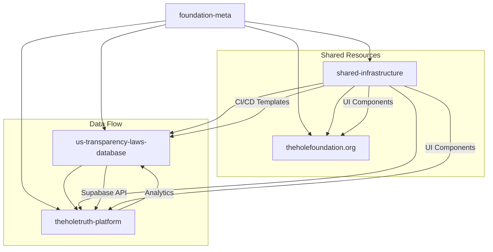
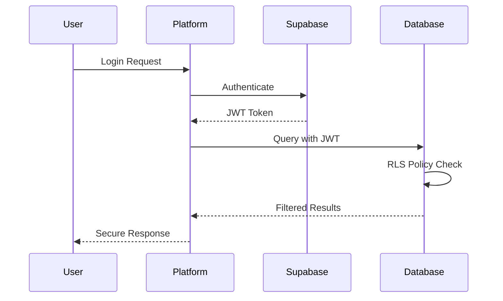

# Cross-Repository Integration Guide

## 🔗 Repository Relationships



## 📊 Database Integration Patterns

### us-transparency-laws-database → theholetruth-platform

**Primary Integration**: Supabase API connection

```javascript
// Platform connects to database API
const supabase = createClient(
  process.env.SUPABASE_URL,
  process.env.SUPABASE_ANON_KEY
)

// Standard query patterns
const stateProfiles = await supabase
  .from('state_profiles')
  .select('*')
  .eq('transparency_grade', 'A')

const foiaTemplates = await supabase
  .from('templates')
  .select('*')
  .eq('state_code', userState)
  .eq('category', 'general')
```

**Real-time subscriptions**:
```javascript
// Listen for database updates
const subscription = supabase
  .channel('state_updates')
  .on('postgres_changes', {
    event: '*',
    schema: 'transparency_data',
    table: 'state_profiles'
  })
  .subscribe()
```

### Database Schema Access Levels

| Schema | Platform Access | Website Access | Public API |
|--------|----------------|----------------|------------|
| `legal_reference` | Full Read | Read-only | Public |
| `transparency_data` | Full Read | Read-only | Public |
| `strategic_intelligence` | Auth Required | No Access | Auth Required |
| `foia_operations` | Full CRUD | No Access | User-specific |

## 🌐 Platform Architecture Integration

### theholetruth-platform Structure
```
theholetruth-platform/
├── apps/
│   ├── web/                 # Main web application
│   ├── mobile/              # React Native app (future)
│   └── api/                 # API proxy/middleware (if needed)
├── packages/
│   ├── ui/                  # Shared UI components
│   ├── database/            # Database client & types
│   ├── auth/                # Authentication utilities
│   └── utils/               # Common utilities
├── docs/                    # Platform-specific docs
└── scripts/                 # Build and deployment scripts
```

### Key Integration Points

1. **Authentication Flow**
   - Supabase Auth for user management
   - RLS policies enforce data access
   - JWT tokens for API authentication

2. **Data Synchronization**
   - Real-time subscriptions for live updates
   - Optimistic UI updates
   - Background sync for offline support

3. **Search Integration**
   - Full-text search via Supabase API
   - Client-side filtering and sorting
   - Search result caching

## 🏢 Website Integration

### theholefoundation.org Connections

- **Static Content**: Mission, about, contact
- **Dynamic Data**: Statistics from database (read-only)
- **Blog/News**: Updates about platform features
- **Documentation**: Links to platform guides

```javascript
// Website pulls aggregate stats from database
const stats = await supabase.rpc('get_foundation_stats')
// Returns: total_jurisdictions, total_requests, success_rate, etc.
```

## 🔧 Shared Infrastructure Patterns

### shared-infrastructure Repository Contents

```
shared-infrastructure/
├── packages/
│   ├── ui-components/       # React components
│   ├── design-system/       # Tokens, themes, styles
│   ├── api-client/          # Supabase client wrapper
│   └── utils/               # Common utilities
├── templates/
│   ├── ci-cd/              # GitHub Actions workflows
│   ├── docker/             # Docker configurations
│   └── deployment/         # Deployment scripts
├── monitoring/
│   ├── dashboards/         # Grafana dashboards
│   ├── alerts/             # Alert configurations
│   └── logging/            # Log aggregation configs
└── docs/                   # Shared documentation
```

### Usage Patterns

**Install shared packages**:
```json
// In platform package.json
{
  "dependencies": {
    "@hole-foundation/ui-components": "workspace:*",
    "@hole-foundation/api-client": "workspace:*",
    "@hole-foundation/design-system": "workspace:*"
  }
}
```

**Import and use**:
```javascript
import { Button, Card, Modal } from '@hole-foundation/ui-components'
import { createApiClient } from '@hole-foundation/api-client'
import { theme } from '@hole-foundation/design-system'

const api = createApiClient({
  supabaseUrl: process.env.SUPABASE_URL,
  supabaseKey: process.env.SUPABASE_ANON_KEY
})
```

## 🚀 Deployment Coordination

### Environment Management

| Environment | Database | Platform | Website | Purpose |
|-------------|----------|----------|---------|----------|
| **Development** | Local Supabase | Local Dev | Local Dev | Development |
| **Staging** | Staging DB | Vercel Preview | Netlify Preview | Testing |
| **Production** | Prod Supabase | Vercel Prod | Netlify Prod | Live Site |

### Deployment Dependencies

1. **Database Changes First**: Deploy schema changes to database repo
2. **Shared Infrastructure**: Update common components if needed
3. **Platform Deployment**: Deploy platform with new API contracts
4. **Website Updates**: Update website with new statistics/links

### CI/CD Integration Triggers

```yaml
# Example: Platform deployment triggers on database changes
name: Deploy Platform on DB Changes
on:
  repository_dispatch:
    types: [database-updated]

jobs:
  deploy:
    runs-on: ubuntu-latest
    steps:
      - name: Deploy Platform
        run: |
          npm run build
          npm run deploy:production
```

## 🔍 Monitoring & Observability

### Cross-Repository Health Checks

```javascript
// Health check endpoint in platform
app.get('/api/health', async (req, res) => {
  const checks = {
    database: await checkDatabaseConnection(),
    supabase: await checkSupabaseAPI(),
    dependencies: await checkExternalDependencies()
  }

  const allHealthy = Object.values(checks).every(check => check.status === 'ok')

  res.status(allHealthy ? 200 : 503).json({
    status: allHealthy ? 'healthy' : 'degraded',
    checks,
    timestamp: new Date().toISOString()
  })
})
```

### Shared Monitoring Dashboard

Track metrics across all repositories:
- Database query performance
- API response times
- User engagement metrics
- Error rates and uptime
- Deployment frequency and success rates

## 📋 Development Workflow

### Feature Development Across Repos

1. **Plan**: Document feature requirements in `foundation-meta`
2. **Database**: Update schema if needed in `us-transparency-laws-database`
3. **Shared**: Update common components in `shared-infrastructure`
4. **Platform**: Implement feature in `theholetruth-platform`
5. **Website**: Update website if needed in `theholefoundation.org`
6. **Test**: Integration testing across all components
7. **Deploy**: Coordinated deployment following dependency order

### Version Compatibility

```json
// Package.json compatibility matrix
{
  "peerDependencies": {
    "@hole-foundation/database-client": "^2.0.0",
    "@hole-foundation/ui-components": "^1.5.0"
  },
  "engines": {
    "node": ">=18.0.0"
  }
}
```

## 🔐 Security Integration

### API Key Management

- **Database Access**: Supabase RLS policies + service role keys
- **Platform Auth**: Supabase Auth with JWT tokens
- **External APIs**: Environment-specific API keys
- **Monitoring**: Separate read-only keys for observability

### Data Flow Security



## 📚 Documentation Synchronization

### Cross-Repository Documentation

- **API Changes**: Update both database and platform docs
- **Feature Releases**: Coordinate release notes across repos
- **User Guides**: Update platform docs when database schema changes
- **Developer Docs**: Keep integration guides current

### Automated Documentation

```yaml
# Sync documentation across repositories
name: Sync Documentation
on:
  push:
    paths:
      - 'docs/**'
      - 'README.md'

jobs:
  sync-docs:
    runs-on: ubuntu-latest
    steps:
      - name: Update Platform Docs
        run: |
          # Script to update platform documentation
          ./scripts/sync-docs.sh platform
```

---

**Maintained By**: The Hole Foundation Development Team
**Last Updated**: September 2025
**Review Schedule**: Monthly integration reviews