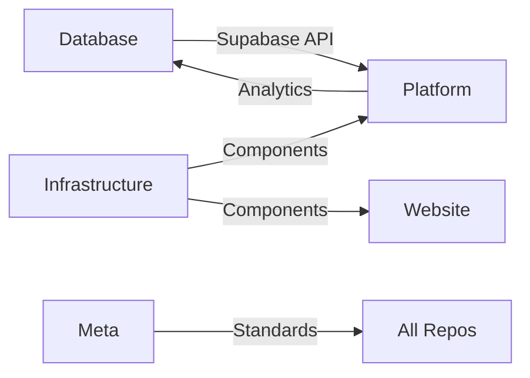

# The Hole Foundation - Complete Organization Plan

## 🎯 Executive Summary

The Hole Foundation GitHub organization structure is now complete and ready for implementation. This comprehensive plan provides everything needed to establish a professional, scalable, and efficient development organization for government transparency tools.

## 🏗️ Organization Architecture

### Repository Structure
```
The-HOLE-Foundation/
├── foundation-meta/                    # 🎯 CENTRAL COMMAND
│   ├── Organization standards & workflows
│   ├── Cross-project coordination
│   ├── Development guidelines
│   └── Integration documentation
├── us-transparency-laws-database/     # 📊 DATA SOURCE
│   ├── Complete Supabase database (51 jurisdictions)
│   ├── Migrations & seed data
│   ├── API endpoints & documentation
│   └── Strategic intelligence data
├── theholetruth-platform/            # 🌐 MAIN APPLICATION
│   ├── Interactive transparency map
│   ├── AI-powered FOIA generator
│   ├── Request tracking system
│   └── Educational resources
├── theholefoundation.org/            # 🏢 FOUNDATION WEBSITE
│   ├── Mission & organizational info
│   ├── Public-facing content
│   ├── Blog & announcements
│   └── Contact & support
└── shared-infrastructure/             # 🔧 COMMON COMPONENTS
    ├── Shared UI components
    ├── CI/CD templates
    ├── Monitoring & logging
    └── Development tools
```

## 📋 Implementation Status

### ✅ Complete & Ready to Deploy
- **Database Integration**: Production-ready Supabase database with all 51 U.S. jurisdictions
- **Architecture Design**: Complete platform architecture with detailed specifications
- **Organization Structure**: Comprehensive GitHub organization plan
- **Development Standards**: Professional development guidelines and workflows
- **Integration Patterns**: Cross-repository integration documentation

### 🚀 Ready for Implementation
- **foundation-meta/**: Template created, ready to initialize
- **theholetruth-platform/**: Architecture complete, ready for development
- **Organization Setup**: Step-by-step implementation guide

## 🔗 Key Integration Points

### Data Flow


### Technology Stack
- **Database**: PostgreSQL with Supabase (production-ready)
- **Platform**: Next.js 14+ with TypeScript and Tailwind CSS
- **Infrastructure**: Vercel, GitHub Actions, PostHog analytics
- **Development**: Turborepo monorepo with comprehensive testing

## 📊 Database Capabilities

### Complete Data Coverage
- **51 Jurisdictions**: All U.S. states + DC + Federal
- **4 Schema Architecture**: Legal reference, transparency data, strategic intelligence, operations
- **Production Ready**: Migrations, seed data, and RLS policies complete
- **Advanced Features**: Full-text search, AI training data, FOIA templates

### API Endpoints Ready
```javascript
// State transparency profiles
GET /api/states?grade=A&response_time=<5

// FOIA request templates
GET /api/templates?state=CA&category=general

// Strategic intelligence
GET /api/intelligence/obstruction-patterns?state=NY

// Full-text statute search
GET /api/search/statutes?query=response+time
```

## 🎨 Platform Features

### Core Applications
1. **Interactive Map**: Visual comparison of all 51 jurisdictions
2. **FOIA Generator**: AI-powered request creation with strategic intelligence
3. **State Comparison**: Side-by-side analysis dashboard
4. **Legal Search**: Full-text search across all transparency laws
5. **Request Tracking**: Personal FOIA request management
6. **Educational Hub**: Tutorials and best practices

### Advanced Capabilities
- **Strategic Intelligence**: AI pattern recognition for obstruction tactics
- **Success Prediction**: ML-powered outcome forecasting
- **Real-time Updates**: Live data synchronization
- **Mobile Optimization**: Responsive design for all devices

## 🚦 Implementation Timeline

### Phase 1: Foundation Setup (Week 1)
- [ ] Create GitHub organization
- [ ] Set up repository structure
- [ ] Configure permissions and security
- [ ] Deploy database to production

### Phase 2: Core Platform (Weeks 2-6)
- [ ] Initialize platform repository
- [ ] Build transparency map MVP
- [ ] Implement FOIA generator core
- [ ] Set up authentication system

### Phase 3: Advanced Features (Weeks 7-10)
- [ ] Complete all platform features
- [ ] Integrate strategic intelligence
- [ ] Build request tracking system
- [ ] Add educational resources

### Phase 4: Launch Preparation (Weeks 11-12)
- [ ] Comprehensive testing
- [ ] Performance optimization
- [ ] Documentation completion
- [ ] Marketing preparation

## 🔐 Security & Compliance

### Data Protection
- **Row Level Security**: Supabase RLS policies on all tables
- **Authentication**: JWT-based with multi-factor support
- **API Security**: Rate limiting and input validation
- **Privacy**: GDPR compliance for user data

### Development Security
- **Code Scanning**: Automated vulnerability detection
- **Secret Management**: Environment-based secret handling
- **Dependency Monitoring**: Automated security updates
- **Access Control**: Granular repository permissions

## 📈 Success Metrics

### Technical Metrics
- **Database Performance**: < 100ms query response times
- **Platform Performance**: Core Web Vitals compliance
- **Uptime**: 99.9% availability target
- **Security**: Zero critical vulnerabilities

### User Metrics
- **FOIA Success Rate**: Improve national average from 65% to 85%
- **User Adoption**: 10K+ registered users in first year
- **Request Volume**: 1K+ FOIA requests generated monthly
- **Educational Impact**: 50K+ tutorial completions

## 💰 Resource Requirements

### Development Team
- **Full-Stack Developers**: 2-3 developers
- **UI/UX Designer**: 1 designer
- **Data Engineer**: 1 part-time for database maintenance
- **DevOps Engineer**: 1 part-time for infrastructure

### Infrastructure Costs
- **Supabase Pro**: ~$25/month (database)
- **Vercel Pro**: ~$20/month (platform hosting)
- **PostHog**: ~$10/month (analytics)
- **GitHub Teams**: ~$4/user/month
- **Total Monthly**: ~$100-200/month

## 🤝 Community & Collaboration

### Open Source Approach
- **Public Repositories**: Core platform and database
- **Community Contributions**: Welcoming external contributors
- **Documentation**: Comprehensive guides for contributors
- **Governance**: Transparent decision-making processes

### Partnership Opportunities
- **Journalism Organizations**: Integration partnerships
- **Legal Aid Groups**: Training and support programs
- **Academic Institutions**: Research collaborations
- **Government Agencies**: Transparency improvement partnerships

## 🎉 Next Steps

### Immediate Actions (This Week)
1. **Create GitHub Organization**: https://github.com/organizations/new
2. **Set up foundation-meta repository** using provided template
3. **Deploy database to Supabase production** using deployment scripts
4. **Begin platform development** with transparency map MVP

### Success Criteria
- [ ] Organization fully operational
- [ ] Database in production with all 51 jurisdictions
- [ ] Platform MVP deployed and functional
- [ ] Team onboarded and productive

## 📞 Support & Resources

### Documentation Locations
- **Organization Plan**: `/foundation-meta-template/`
- **Platform Architecture**: `/theholetruth-platform-architecture/`
- **Database Integration**: `/supabase/` with complete migrations and seed data
- **Deployment Guides**: Ready-to-use scripts and instructions

### Key Files
- **Organization Setup**: `ORGANIZATION_SETUP_GUIDE.md`
- **Development Standards**: `standards/DEVELOPMENT_STANDARDS.md`
- **Cross-Repo Integration**: `integration/CROSS_REPO_INTEGRATION.md`
- **Platform Features**: `PLATFORM_FEATURES.md`

---

## 🏆 Ready for Launch

The Hole Foundation now has everything needed for a successful launch:

✅ **Complete Database** - 51 jurisdictions, production-ready
✅ **Detailed Architecture** - Scalable, professional platform design
✅ **Organization Structure** - GitHub organization ready to implement
✅ **Development Standards** - Professional workflows and guidelines
✅ **Integration Plans** - Cross-repository coordination patterns
✅ **Implementation Guide** - Step-by-step setup instructions

**Status**: 🟢 **READY FOR IMPLEMENTATION**
**Next Action**: Create GitHub organization and begin Phase 1 setup

---

*The future of government transparency starts here. Let's build it together.*

**The Hole Foundation** | *Making transparency accessible to all*