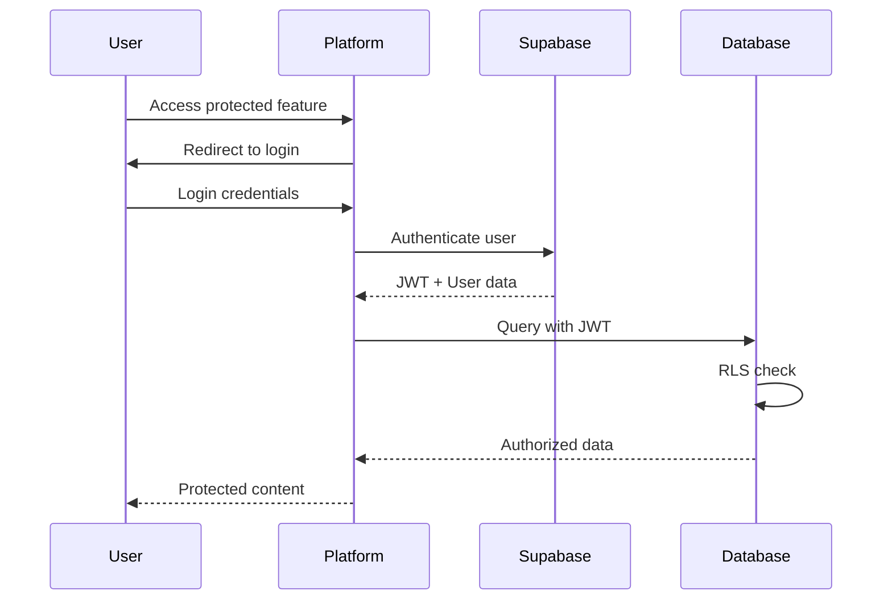

# TheHoleTruth Platform - Architecture Design

**Repository**: `theholetruth-platform/`
**Purpose**: Main transparency tools platform for citizens and researchers

## 🎯 Platform Overview

TheHoleTruth Platform is the primary user-facing application that transforms The Hole Foundation's transparency law database into practical tools for citizens, journalists, researchers, and advocates.

### Core Features

1. **🗺️ Interactive Transparency Map**: Visual comparison of all 51 U.S. jurisdictions
2. **📝 AI-Powered FOIA Generator**: Smart request creation with strategic intelligence
3. **📊 State Comparison Dashboard**: Side-by-side analysis of transparency laws
4. **🔍 Legal Statute Search**: Full-text search across all transparency laws
5. **📈 Request Tracking**: Personal FOIA request management
6. **🎓 Educational Resources**: How-to guides and best practices
7. **🤖 Strategic Intelligence**: AI-powered insights on obstruction patterns

## 🏗️ Technical Architecture

### Technology Stack

```
Frontend:
├── Next.js 14+ (App Router)
├── React 18+ with TypeScript
├── Tailwind CSS + Headless UI
├── Framer Motion (animations)
├── React Query (data fetching)
├── Zustand (state management)
└── React Hook Form (forms)

Backend Integration:
├── Supabase (database + auth)
├── Edge Functions (AI features)
├── Vercel (deployment)
└── PostHog (analytics)

Development:
├── Turborepo (monorepo)
├── ESLint + Prettier
├── Jest + Testing Library
├── Playwright (E2E)
├── Storybook (components)
└── TypeScript strict mode
```

### Repository Structure

```
theholetruth-platform/
├── apps/
│   ├── web/                         # Main Next.js application
│   │   ├── src/
│   │   │   ├── app/                 # App Router pages
│   │   │   ├── components/          # React components
│   │   │   ├── lib/                 # Utilities and configurations
│   │   │   ├── hooks/               # Custom React hooks
│   │   │   ├── types/               # TypeScript definitions
│   │   │   └── styles/              # Global styles
│   │   ├── public/                  # Static assets
│   │   ├── tests/                   # Test files
│   │   └── docs/                    # App-specific documentation
│   └── mobile/                      # Future: React Native app
├── packages/
│   ├── ui/                          # Shared UI components
│   ├── database/                    # Database client & types
│   ├── auth/                        # Authentication utilities
│   ├── analytics/                   # Analytics and tracking
│   ├── api-client/                  # API client wrapper
│   └── config/                      # Shared configurations
├── docs/                            # Platform documentation
├── scripts/                         # Build and deployment scripts
├── .github/                         # GitHub workflows
└── docker/                         # Container configurations
```

## 🗺️ Core Applications

### 1. Interactive Transparency Map

**Route**: `/map`
**Purpose**: Visual comparison of transparency laws across all 51 jurisdictions

```tsx
// Map component structure
<TransparencyMap>
  <USMap
    data={stateProfiles}
    metric={selectedMetric}
    onStateSelect={handleStateSelect}
  />
  <StateDetailPanel
    state={selectedState}
    profile={stateProfile}
    comparison={comparisonStates}
  />
  <MetricSelector
    metrics={['transparency_grade', 'response_time', 'success_rate']}
    selected={selectedMetric}
    onChange={setSelectedMetric}
  />
  <ComparisonTool
    states={selectedStates}
    onAddState={addToComparison}
    onRemoveState={removeFromComparison}
  />
</TransparencyMap>
```

**Key Features**:
- **Choropleth visualization** with customizable metrics
- **Hover interactions** showing quick stats
- **Multi-state comparison** side-by-side
- **Responsive design** for mobile and desktop
- **Export capabilities** for data and visualizations

### 2. AI-Powered FOIA Generator

**Route**: `/generate`
**Purpose**: Intelligent FOIA request creation with strategic insights

```tsx
// FOIA Generator flow
<FOIAGenerator>
  <StateSelector
    states={allStates}
    onSelect={setTargetState}
    showRecommendations={true}
  />
  <RequestTypeSelector
    categories={foiaCategories}
    templates={availableTemplates}
    onSelect={setRequestType}
  />
  <SmartFormBuilder
    state={targetState}
    template={selectedTemplate}
    userProfile={userProfile}
    onGenerate={generateRequest}
  />
  <StrategicInsights
    state={targetState}
    requestType={selectedRequestType}
    tactics={stateTactics}
    warnings={obstructionPatterns}
  />
  <RequestPreview
    generatedText={requestText}
    legalCitations={relevantStatutes}
    tips={strategicTips}
    onEdit={editRequest}
    onSubmit={submitRequest}
  />
</FOIAGenerator>
```

**AI Enhancement Features**:
- **Context-aware templates** based on state and request type
- **Strategic intelligence integration** showing common obstacles
- **Legal citation suggestions** with relevant statute sections
- **Success probability estimation** based on historical data
- **Personalized tips** based on user's request history

### 3. State Comparison Dashboard

**Route**: `/compare`
**Purpose**: Side-by-side analysis of transparency laws and performance

```tsx
// Comparison dashboard layout
<ComparisonDashboard>
  <StateSelector
    maxStates={4}
    selectedStates={comparisonStates}
    onStateChange={updateComparison}
  />
  <ComparisonGrid>
    <MetricComparison
      states={comparisonStates}
      metrics={comparisonMetrics}
      visualization="chart"
    />
    <LegalComparison
      states={comparisonStates}
      statutes={relevantStatutes}
      highlights={keyDifferences}
    />
    <PerformanceComparison
      states={comparisonStates}
      successRates={successRateData}
      responseTimes={responseTimeData}
    />
  </ComparisonGrid>
  <ExportTools
    data={comparisonData}
    formats={['PDF', 'CSV', 'JSON']}
    onExport={handleExport}
  />
</ComparisonDashboard>
```

### 4. Legal Statute Search

**Route**: `/search`
**Purpose**: Full-text search across all transparency law statutes

```tsx
// Search interface
<StatuteSearch>
  <SearchInput
    query={searchQuery}
    filters={searchFilters}
    onSearch={handleSearch}
    suggestions={searchSuggestions}
  />
  <SearchFilters>
    <StateFilter states={allStates} />
    <CategoryFilter categories={legalCategories} />
    <DateFilter dateRange={effectiveDateRange} />
  </SearchFilters>
  <SearchResults
    results={searchResults}
    highlighting={true}
    pagination={paginationConfig}
  />
  <ResultDetail
    statute={selectedStatute}
    fullText={statuteFullText}
    relatedCases={courtPrecedents}
    practicalTips={strategicInsights}
  />
</StatuteSearch>
```

**Search Features**:
- **Full-text search** with PostgreSQL full-text search
- **Advanced filters** by state, category, effective date
- **Highlighted results** showing matching text
- **Related content** suggestions
- **Citation tools** for research and legal work

### 5. Request Tracking System

**Route**: `/requests`
**Purpose**: Personal FOIA request management and tracking

```tsx
// Request tracking dashboard
<RequestTracker>
  <RequestsList
    requests={userRequests}
    filters={requestFilters}
    sorting={requestSorting}
  />
  <RequestDetail
    request={selectedRequest}
    timeline={requestTimeline}
    documents={receivedDocuments}
    actions={availableActions}
  />
  <AutomatedReminders
    upcomingDeadlines={deadlineReminders}
    followUpActions={followUpTasks}
  />
  <Analytics
    userStats={requestStatistics}
    successRate={personalSuccessRate}
    averageResponseTime={personalResponseTimes}
  />
</RequestTracker>
```

## 🎨 Design System

### Visual Design Principles

1. **Government Transparency**: Clean, official, trustworthy aesthetic
2. **Data Visualization**: Clear charts and maps for complex information
3. **Accessibility First**: WCAG 2.1 AA compliance
4. **Mobile Responsive**: Mobile-first responsive design
5. **Performance**: Fast loading and smooth interactions

### Color Palette

```css
:root {
  /* Primary Brand Colors */
  --color-primary-50: #eff6ff;
  --color-primary-500: #3b82f6;
  --color-primary-900: #1e3a8a;

  /* Government Trust Colors */
  --color-government: #1f2937;
  --color-success: #059669;
  --color-warning: #d97706;
  --color-danger: #dc2626;

  /* Transparency Grades */
  --color-grade-a: #10b981;
  --color-grade-b: #84cc16;
  --color-grade-c: #f59e0b;
  --color-grade-d: #f97316;
  --color-grade-f: #ef4444;
}
```

### Typography

```css
/* Primary fonts for official, trustworthy feel */
font-family:
  'Inter',
  'SF Pro Display',
  -apple-system,
  BlinkMacSystemFont,
  'Segoe UI',
  system-ui,
  sans-serif;

/* Code/legal text */
font-family:
  'Fira Code',
  'SF Mono',
  Monaco,
  'Cascadia Code',
  monospace;
```

## 🔐 Authentication & Authorization

### User Types & Permissions

```typescript
type UserRole =
  | 'public'          // Anonymous users
  | 'citizen'         // Registered citizens
  | 'journalist'      // Verified journalists
  | 'researcher'      // Academic researchers
  | 'advocate'        // Legal advocates
  | 'admin'           // Foundation administrators

interface UserPermissions {
  // Public features
  viewTransparencyMap: boolean
  searchStatutes: boolean
  compareStates: boolean

  // Authenticated features
  generateFOIARequests: boolean
  trackRequests: boolean
  accessStrategicIntelligence: boolean
  exportData: boolean

  // Advanced features
  accessAPIKeys: boolean
  bulkOperations: boolean
  advancedAnalytics: boolean

  // Admin features
  manageUsers: boolean
  moderateContent: boolean
  systemConfiguration: boolean
}
```

### Authentication Flow



## 📊 Data Flow & State Management

### Global State Architecture

```typescript
// Zustand stores for different domains
interface AppState {
  // User state
  user: UserStore
  auth: AuthStore

  // Data state
  transparencyData: TransparencyDataStore
  search: SearchStore
  requests: RequestStore

  // UI state
  ui: UIStore
  map: MapStore
  comparison: ComparisonStore
}

// Example: Transparency Data Store
interface TransparencyDataStore {
  stateProfiles: StateProfile[]
  selectedStates: string[]
  comparisonData: ComparisonData | null

  actions: {
    loadStateProfiles: () => Promise<void>
    selectState: (stateCode: string) => void
    addToComparison: (stateCode: string) => void
    removeFromComparison: (stateCode: string) => void
  }
}
```

### Data Fetching Patterns

```typescript
// React Query for server state
const useStateProfiles = () => {
  return useQuery({
    queryKey: ['state-profiles'],
    queryFn: async () => {
      const { data } = await supabase
        .from('state_profiles')
        .select('*')
        .order('state_name')
      return data
    },
    staleTime: 1000 * 60 * 5, // 5 minutes
    cacheTime: 1000 * 60 * 30, // 30 minutes
  })
}

// Real-time subscriptions
const useRealTimeUpdates = () => {
  useEffect(() => {
    const subscription = supabase
      .channel('state_updates')
      .on('postgres_changes', {
        event: '*',
        schema: 'transparency_data',
        table: 'state_profiles'
      }, payload => {
        // Update local cache
        queryClient.invalidateQueries(['state-profiles'])
      })
      .subscribe()

    return () => subscription.unsubscribe()
  }, [])
}
```

## 🚀 Performance Optimization

### Core Web Vitals Targets

- **First Contentful Paint**: < 1.2s
- **Largest Contentful Paint**: < 2.5s
- **First Input Delay**: < 100ms
- **Cumulative Layout Shift**: < 0.1

### Optimization Strategies

1. **Image Optimization**: Next.js Image component with WebP
2. **Code Splitting**: Route-based and component-based splitting
3. **Caching**: React Query + browser caching
4. **Database**: Optimized queries with proper indexing
5. **CDN**: Static assets via Vercel Edge Network

### Bundle Analysis

```typescript
// Bundle size targets
const bundleSizeTargets = {
  'main': '< 150KB gzipped',
  'vendor': '< 200KB gzipped',
  'chunks': '< 50KB gzipped each'
}

// Performance monitoring
const performanceMetrics = {
  'api-response-time': '< 200ms p95',
  'database-query-time': '< 100ms p95',
  'page-load-time': '< 2s p95'
}
```

## 🧪 Testing Strategy

### Testing Pyramid

```
E2E Tests (Playwright)
├── Critical user journeys
├── Cross-browser testing
└── Accessibility testing

Integration Tests (Jest + Testing Library)
├── Component integration
├── API integration
└── Database integration

Unit Tests (Jest)
├── Individual components
├── Utility functions
└── Business logic
```

### Test Coverage Targets

- **Unit Tests**: 90% coverage
- **Integration Tests**: 80% coverage
- **E2E Tests**: 100% critical paths

## 📈 Analytics & Monitoring

### User Analytics (PostHog)

```typescript
// Track user interactions
const trackEvent = (event: string, properties?: Record<string, any>) => {
  posthog.capture(event, {
    ...properties,
    platform: 'web',
    version: process.env.NEXT_PUBLIC_VERSION
  })
}

// Key events to track
const analyticsEvents = {
  'map_state_selected': { state_code: string }
  'foia_request_generated': { state_code: string, category: string }
  'statute_searched': { query: string, results_count: number }
  'comparison_created': { states: string[], metric: string }
  'request_tracked': { request_id: string, action: string }
}
```

### Performance Monitoring

```typescript
// Real User Monitoring
const performanceObserver = new PerformanceObserver((list) => {
  list.getEntries().forEach((entry) => {
    // Send metrics to monitoring service
    sendMetric({
      name: entry.name,
      value: entry.duration,
      timestamp: Date.now()
    })
  })
})

performanceObserver.observe({
  entryTypes: ['navigation', 'paint', 'largest-contentful-paint']
})
```

## 🔧 Development Workflow

### Local Development Setup

```bash
# Clone repository
git clone https://github.com/The-HOLE-Foundation/theholetruth-platform.git
cd theholetruth-platform

# Install dependencies
npm install

# Set up environment variables
cp .env.example .env.local
# Edit .env.local with your Supabase credentials

# Start development server
npm run dev

# Run tests
npm run test
npm run test:e2e

# Build for production
npm run build
```

### Feature Development Process

1. **Design**: Create designs in Figma/wireframes
2. **Types**: Define TypeScript interfaces
3. **Components**: Build UI components with Storybook
4. **Integration**: Connect to database API
5. **Testing**: Unit + integration tests
6. **E2E**: End-to-end user journeys
7. **Review**: Code review and QA
8. **Deploy**: Staging → Production

---

**Status**: 🚧 Architecture Complete - Ready for Implementation
**Next Steps**: Repository setup and MVP development
**Maintainer**: The Hole Foundation Development Team